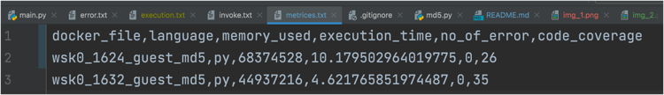

# Fuzzing in serverless architecture

Serverless computing is becoming increasingly popular for building and deploying an application, however, it also introduces new security risks and vulnerabilities.
A fuzzing architecture can provide a comprehensive approach to testing and securing serverless functions. This project aims to design Fuzzer that can help prioritize security and ensure reliability in a serverless framework.

## Requirement Installation

#clone the repo 
git clone https://github.com/Man1ish/fuzzerapplication.git


```bash
#Wsk cli is required to communicate with openwhisk
# download and setup the wsk tool
https://github.com/apache/openwhisk-cli

#Cli setup step
https://github.com/apache/openwhisk-cli#running-the-wsk-cli


#running the framework
#In first terminal, run the framework
cd openwhisk
./gradlew core:standalone:bootRun


#Establish the connection between wsk cli and openwhisk framework
wsk property set \
  --apihost 'http://localhost:3233' \
  --auth '23bc46b1-71f6-4ed5-8c54-816aa4f8c502:123zO3xZCLrMN6v2BKK1dXYFpXlPkccOFqm12CdAsMgRU4VrNZ9lyGVCGuMDGIwP'


#In the main repository, 

#setup the python environment
python3 -m venv venv
venv/bin/python -m pip install --upgrade pip
venv/bin/python -m pip install -r requirements.txt
source venv/bin/activate

#run the api server in one terminal
python api_server.py


```

## Input to fuzzer
1. Code: Python and Javascript
2. Create action command
    1. wsk action update md5 --docker pandeymanish93/python3action:serverless-cache read-input.py --memory 192 
    2. wsk action invoke md5 --param input helloworld

We can modify the values like md5, docker value, memory and input
    
## Collection of Coverage
In order to indentify the coverage of the function, we inserted following code in the function 
```bash
logging.info(this, s"container creation message for ${creation.invocationNamespace}/${creation.action} is received")
logging.error(this, "Error while creating the container")
```
The log message is send to the fuzzer application, where the information are saved in log table.

## Fuzzer Techniques
1. Mutation fuzzing: input parameter 
2. Random fuzzing: memory and code Code: Python and Javascript

## Fuzzer Guided
1. Fuzzer is guided through number of code coverage

## Result
1. Code coverage, number of error, memory utilize, present in output/metrices.txt file

## Run project

To run the fuzzer in other terminal

```bash
source venv/bin/activate
python main.py
```

